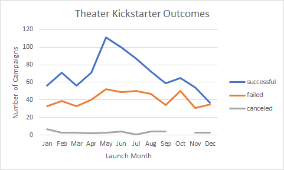

# Kickstarting with Excel

## Overview of Project
This project is a report given to Louise containing a chart showing kickstarter outcomes based on launch date, and a chart showing kickstarter outcomes based on funding goals. Louise's past kickstarter performed well and this information can be used by Louise to influence her fundraising in the future.

### Purpose
The purpose of this project is to provide deliverables to the client(Louise) conveying how different kickstarter campains performed based on their launch date, as well as their funding goals. 

## Analysis and Challenges
    
### Analysis of Outcomes Based on Launch Date
In order to create the deliverable chart "Theater Outcomes by Launch Date" I first created a pivot table filtering for Parent Category, as well as Years. I then set "outcomes" as a column, and "Date Created Count" as Rows. At this point I had to delete Years and Days from the Rows section, so only months were displayed. I also Added "Count of outcomes" to the values section, so the total number of campaigns in each outcome/month would be added up. I then used the pivot table to create a line graph displaying the data in a more digestible format. No code was needed for this analysis.

### Analysis of Outcomes Based on Goals
In order to create the deliverable chart "Outcomes Based on Goals" I first had to create a table calculating Number of Successful, Failed, and Canceled Projects based on their funding goal. To do this I used the code =COUNTIFS(Kickstarter!$D:$D, "<1000", Kickstarter!$F:$F, "successful", Kickstarter!$R:$R, "plays") which filtered for the goal amount, successful vs failed vs canceled, and subcategory(plays). I altered this code for each row and column to adjust for successful, failed, and canceled, as well as for goal amount. The subcategory stayed the same the whole time. I then calculated total projects for each goal range using =SUM(B2:D2) adjusting the inputs so they reflected adding up all successful, failed, and canceled campaigns. Using this, I calculated percentage successful, failed, or canceled for each goal range using =(B2/E2) adjusting the inputs so they reflected dividing number of successful, failed, or canceled campaigns by the total number of projects for each goal. I highlighted The Goal, Percentage Successful, Percentage Failed, and Percentage Canceled columbs, and inserted a line chart to create my deliverable graph. 

### Challenges and Difficulties Encountered
*    For the first deliverable, I struggled at first to figure out how to get only months as the Row Labels, but soon realized that when dragging years into the rows section, it splits into days, months, and years. This just needed to be simplified down to only months.

*    I did not have any challenges with the second deliverable, but I can see how making sure the code is correct to calculate the number of the different outcomes could prove to be a problem. If any of the three filters in the COUTIFS statement are left out, then the output will not be correct. Additionally when copying the formula down to different goals, making sure that the COUTIFS statement contains two different filters for greater than and also less than a certain value, could be a problem. For example, my code for the goal range of 10000-14999 looks like this: =COUNTIFS(Kickstarter!$D:$D, "<=14999", Kickstarter!$D:$D, ">=10000", Kickstarter!$F:$F, "successful", Kickstarter!$R:$R, "plays"). There are a lot of areas for small mistakes in this statement.

## Results

- Based on the chart I produced for Outcomes based on Launch Date, I can conclude that in order to be successful, May, followed by June are the best months to launch a theater kickstarter. I can also conclude that December is the worst month to launch a Theater Campaign.
- Based on the chart I produced for Outcomes based on Goals, I can conclude that the most successful goals were less than $5000, and between $35000-$45000. Additionally, about 50% of kickstarters were successful with goals between $5000-$25000. I would not recommend goals over $45000, as they were almost never successful.
- One limitation of the dataset for OUtcomes based on Goals is that the graph does not show how many total projects there are for each point. This can be misleading, especially when it comes to the higher goals, which had very few projects/a small sample size. Additionally, for the Outcomes by Launch Date data, the graph and pivot table are based on start date, but do not show the actual length of the campaign, which could have a large effect on success.
- We could create a stacked bar graph for Outcomes based on goals, as it would give us a good visual of percentage successful vs failed as well as how many total kickstarters there are for each goal range. I would also like to see a line graph showing outcomes vs length of campaign, to see if there is a trend there. 
